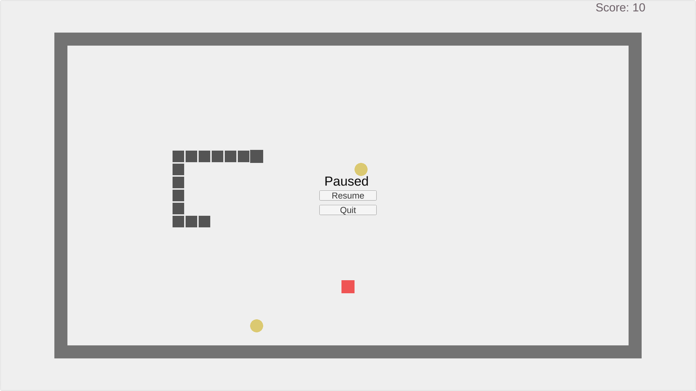
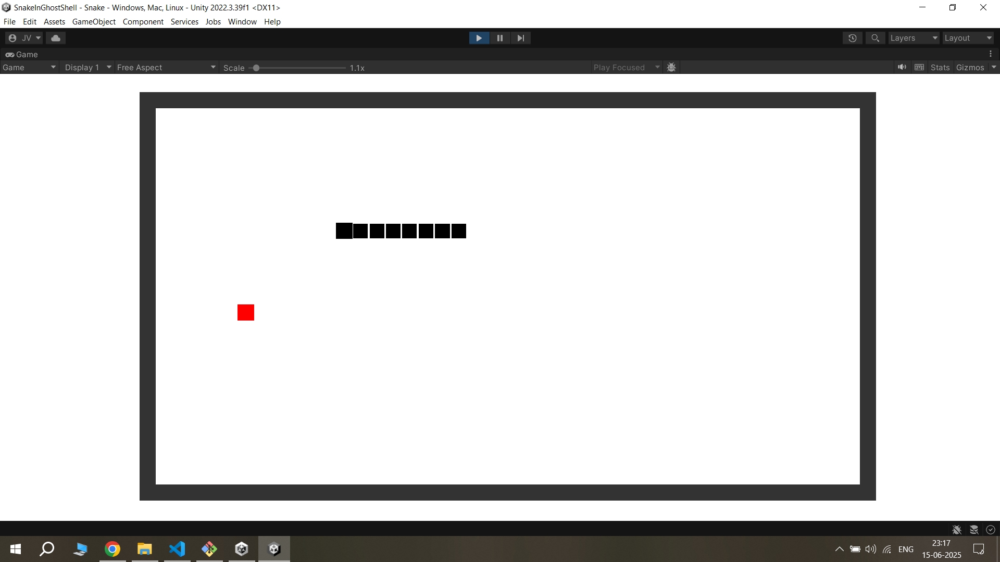
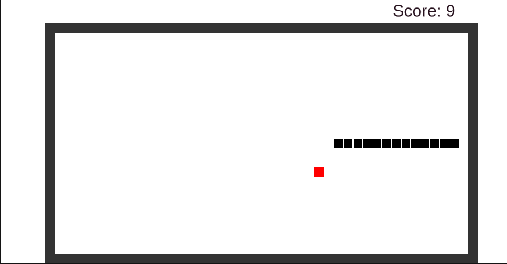
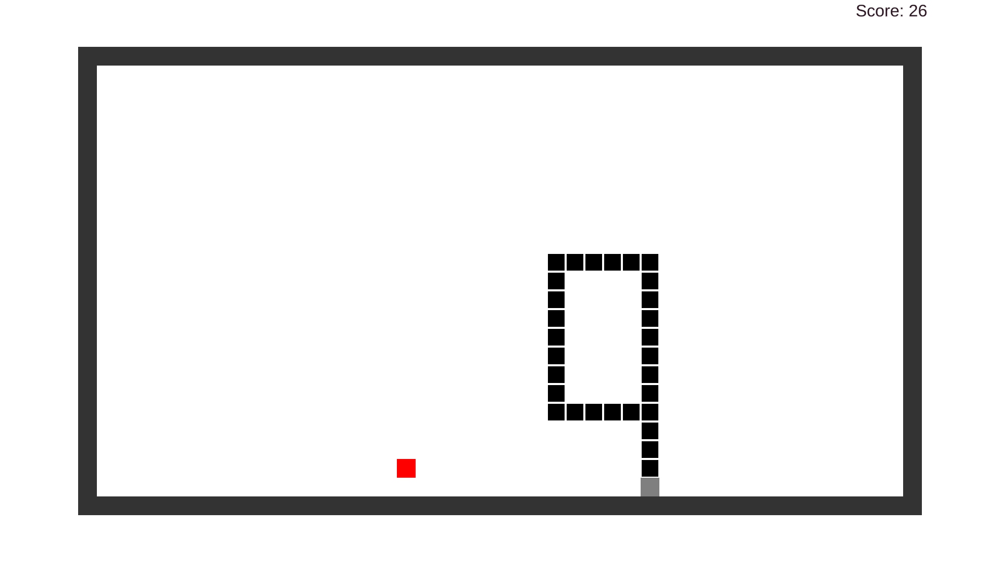
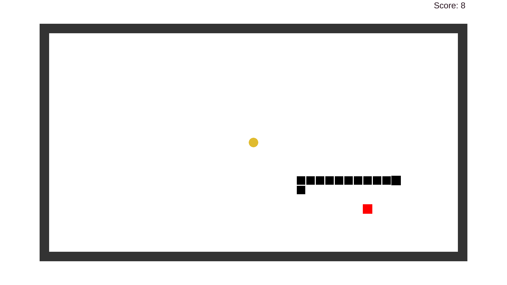

# 🐍 Snake in a Ghost Shell 👻

A small twist on the classic Snake game — built in Unity with love, logic, and a little ghost magic.

---

## 🎮 Gameplay

- Eat food to grow your snake.
- Every **5 foods**, a **special power-up** appears.
- Grab it to activate **Phase Mode** — pass through your own tail for 7 seconds.
- Score points, survive longer, and dominate the grid.

---

## 🧠 Features

- ⚡ **Phase Mode**: Temporary invincibility with visual effects
- 📈 **Live Score Counter** (TextMeshPro-powered)
- 🌐 **Screen Wraparound** movement (Pac-Man style)
- 💀 Game resets on wall or self collision
- 🎨 Simple but clean pixel-style visuals

---

## 📸 Screenshots






```markdown

